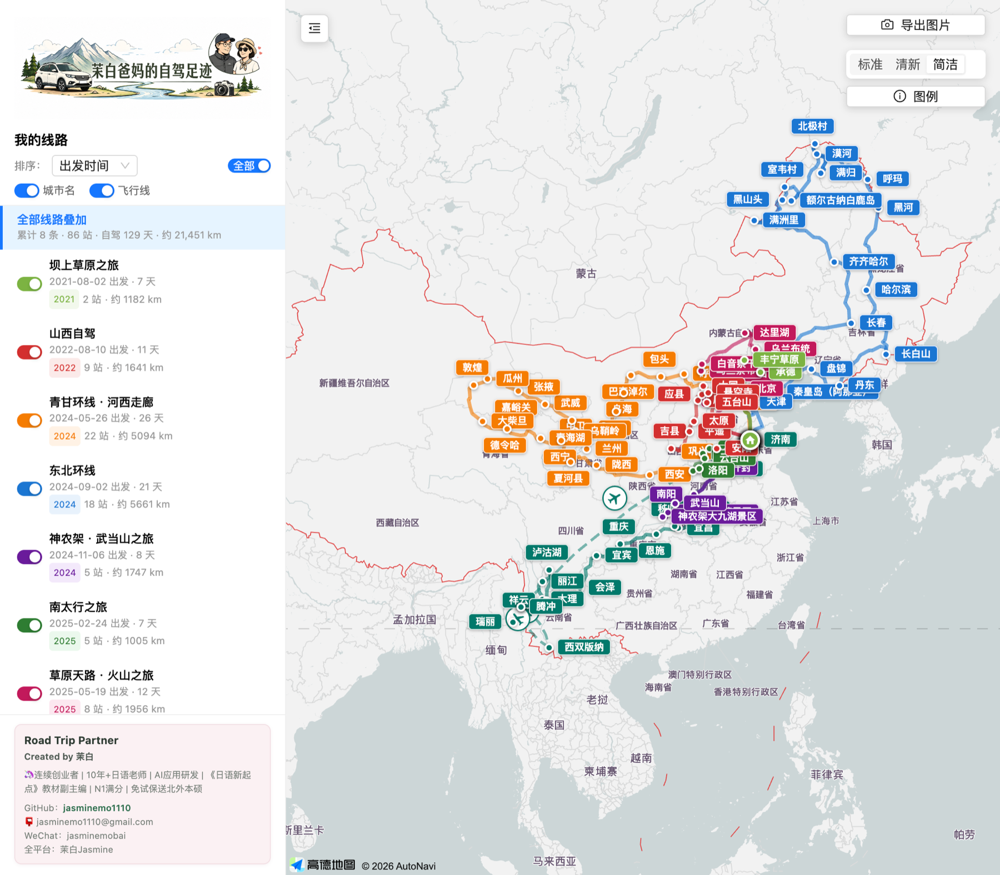
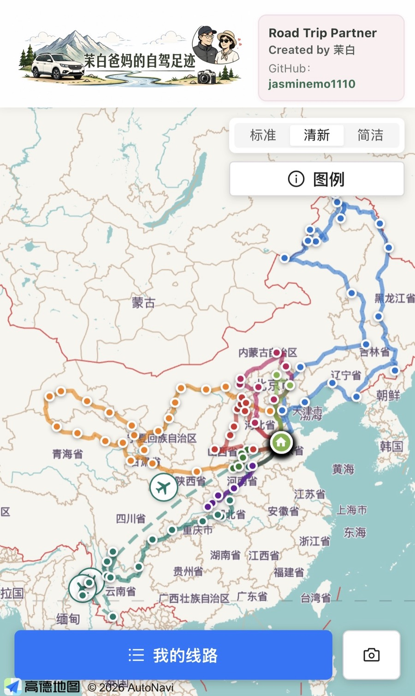
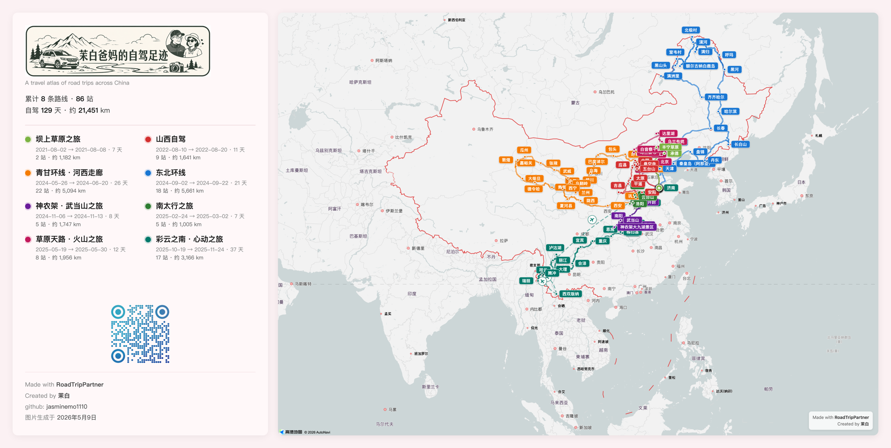
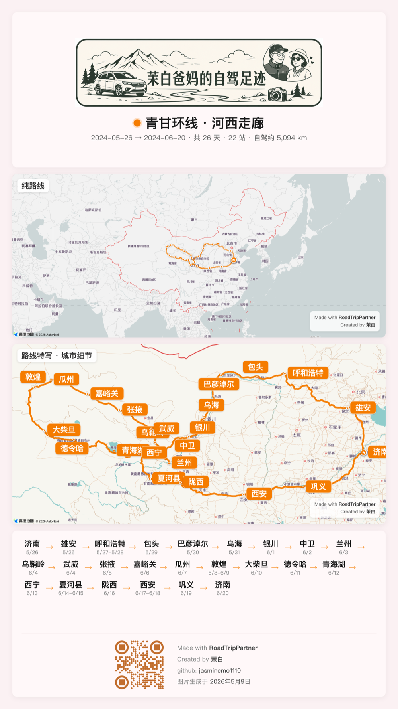

<p align="center">
  
</p>

<p align="center">
  <em>在地图上记录自驾旅行路线，支持照片、日期、多线路叠加与高清图片导出。</em>
</p>

<p align="center">
  <em>A road trip atlas for self-driving routes (originally built for China; PRs welcome to add overseas map providers).</em>
</p>

<p align="center">
  Created by <a href="https://github.com/jasminemo1110">茉白</a> · MIT License
</p>

---

## 效果展示

> 以下截图来自作者本人在 [road-trip-partner.fly.dev](https://road-trip-partner.fly.dev/) 的实际部署。新部署默认走"Road Trip Partner"通用品牌——所有个人信息和图片都通过环境变量自定义（见 [品牌定制](#品牌定制branding)）。

<table>
  <tr>
    <td align="center" width="65%">
      <br/>
      <em>桌面端：8 条路线叠加显示 · 左侧线路面板 · 右侧地图样式切换</em>
    </td>
    <td align="center" width="35%">
      <br/>
      <em>移动端：父母友好的大字号 · "我的线路"抽屉</em>
    </td>
  </tr>
  <tr>
    <td align="center">
      <br/>
      <em>总览导出图：所有路线 + 城市站点 + 数据汇总</em>
    </td>
    <td align="center">
      <br/>
      <em>单条路线导出图：纯路线图 + 城市细节图 + 站点流</em>
    </td>
  </tr>
</table>

---

## 这是什么

一个记录自驾路线的个人工具（最初茉白为退休后热爱自驾的父母创造）

能做的事：

- 在中国地图上同时显示多条彩色路线，每条路线下挂多个城市站点
- 路线会自动计算总距离，可按距离、日期等元素排序，可收藏线路，可自定义线路显示
- 每个站点可以记录住宿、餐饮、景点、视频/文章链接、照片
- 一键导出高清图片（横版、竖版、单条路线、多条路线汇总等多种排版）。**目前本地导出最可靠**——`./start.sh` 起本地服务、打开 `/export` 页面、一键导出 4× 高清 PNG ZIP。线上一键导出虽然实现了，但受 Fly 机器内存 (1GB) + AMap 渲染时序的限制，偶尔会产生不完整或样式错误的图片，**生产用建议本地导出**（详见 [扩展点](#扩展点想魔改的看这里)）
- 编辑链接 token 保护，公开链接只读
- 移动端友好的大字号布局（设计时考虑了不熟悉 App 的父母）
- 支持 GPX/KML 文件导入轨迹（自动 WGS-84 → GCJ-02 坐标转换，兼容 GPX 1.0/1.1 + KML）

## 快速安装（推荐：扔给 AI 编程助手）

把下面这段贴给 Claude Code / Cursor / Codex / 其他 AI 编程助手，它会一站式帮你跑起来：

> 我想在本地运行 Road Trip Partner 这个开源项目（仓库：`https://github.com/jasminemo1110/road-trip-partner`）。请帮我：
> 1. clone 仓库到 `~/road-trip-partner`
> 2. 创建 Python 虚拟环境并安装 `backend/requirements.txt`
> 3. 安装 `frontend/` 的 npm 依赖
> 4. 提醒我去 [高德开放平台](https://lbs.amap.com/) 申请一个 Web 端 JS API Key 和对应的 Security Code，然后写入 `frontend/.env`（格式见 `frontend/.env.example`）
> 5. 通过 `./start.sh` 启动后端（8000）和前端（5173）
> 6. 在浏览器打开 `http://localhost:5173` 验证能看到空的地图界面

## 手动安装

```bash
# 1. clone
git clone https://github.com/jasminemo1110/road-trip-partner.git
cd road-trip-partner

# 2. 后端依赖
cd backend
python3 -m venv .venv
.venv/bin/pip install -r requirements.txt
cd ..

# 3. 前端依赖
cd frontend
npm install
cd ..

# 4. 配置 AMap 密钥（必须，见下一节）
cp frontend/.env.example frontend/.env
# 编辑 frontend/.env，填入你的 VITE_AMAP_KEY 和 VITE_AMAP_SECURITY_CODE

# 5. 一键启动
./start.sh
# 后端: http://localhost:8000
# 前端: http://localhost:5173
```

## AMap 密钥申请（必须！）

### 申请步骤

1. 注册 [高德开放平台](https://lbs.amap.com/) 账号
2. **应用管理 → 我的应用 → 创建新应用**
3. 添加 Key：服务平台选 **Web端(JS API)**
4. 把 Key 写入 `frontend/.env`：
   ```
   VITE_AMAP_KEY=你的_JS_API_Key
   VITE_AMAP_SECURITY_CODE=你的_Security_Code
   ```

### ⚠️ 重要的坑：`_AMapSecurityConfig`

AMap JS API v2.0 的 Web 服务（Driving / AutoComplete / DistrictSearch 等）**必须**在脚本加载前注入 security code，否则会**静默失败**（路线退化为直线、城市搜索无结果，没有报错）：

```typescript
// 1. 先注入 security config
window._AMapSecurityConfig = { securityJsCode: SECURITY_CODE };
// 2. 然后才加载 AMap 脚本
script.src = `https://webapi.amap.com/maps?v=2.0&key=${AMAP_KEY}`;
```

这部分已经在 `frontend/src/components/MapView.tsx` 的 `loadAMapScript()` 里实现好了，**只要你正确配了 `VITE_AMAP_SECURITY_CODE`，就不用管**。但如果你看到"路线显示为直线"或"城市搜索没结果"，第一件事就是检查这个 security code 配对。

## 添加路线

项目支持三种添加路线的方式，从"传统"到"最舒服"：

### 方式 1：手动输入（最直接，适合一两条）

主页左侧栏点 **"➕ 新建路线"**，在弹出的编辑面板里：

- 填路线名字、年份、颜色
- 保存后开始添加城市站点：输入城市名（自动联想坐标） → 选日期 → 设交通方式（默认自驾，可改飞机）
- 每个站点可以再补充住宿、餐饮、景点、视频/文章链接、照片

### 方式 2：导入 GPX / KML 文件（适合已有 GPS 轨迹）

新建路线、保存基本信息后，编辑面板里会出现 **"导入 GPX/KML"** 按钮：

- 兼容 GPX 1.0 / 1.1 和 KML（Point Placemarks + LineString 轨迹都支持）
- iPhone "Footpath"、Garmin Connect、Strava、Google My Maps、两步路、六只脚 等导出的文件都能用
- 中国境内坐标会**自动 WGS-84 → GCJ-02 转换**（解决导入后点偏移到郊外的问题）
- 单文件大小上限 5MB（可通过 `MAX_IMPORT_BYTES` 环境变量调整）

### 方式 3：让 AI Agent 帮你写入（最舒服，强烈推荐）

> **作者实际使用中发现这是最方便的方式。**

把你整理好的资料（行程表、攻略文档、**家人发你的微信消息**、Excel、随手笔记……任何形式）直接扔给 Claude Code / Cursor / Codex / 其他 AI 编程助手，让它帮你批量写入数据库。

#### 一个真实的例子

这个项目最初就是这样跑起来的——茉白的妈妈在微信里直接给她发了几段消息列出全部行程：

```
2024年11月6号南阳，7号神农架天燕景区，8号9号神农架大九湖景区，
10号11号武当山，12号开封，13号济南

神农架，武当山之旅
```

把这段话和下面的 prompt 一起扔给 AI Agent，一分钟就录入完毕：

> 这是一段我家人发给我的自驾路线消息，请帮我录入到本地 Road Trip Partner（`http://localhost:8000`）：
>
> ```
> [贴上消息]
> ```
>
> 请：
> 1. 调 `POST /api/routes` 创建一条新路线（路线名取消息里的"XXX之旅"，颜色和年份自己定）
> 2. 解析每个城市 + 日期，对每个站点调 `POST /api/routes/{id}/stops`，传 city_name、longitude、latitude、arrival_date、departure_date
> 3. 坐标用高德搜索 API 查或者按常识填经纬度
> 4. 公网部署的话每个请求加 `X-Edit-Token: <你的_EDIT_TOKEN>` header

AI Agent 会自动解析模糊的日期格式（"8号9号神农架"→ 8 号到达、9 号离开）、连续日期、家乡起终点等细节，比你手动一个个填快几十倍。后端完整 API schema 见 `backend/main.py`。

## 品牌定制（Branding）

项目支持运行时配置站名、个人信息、自定义图片等，**全部通过环境变量**——同一份代码可以部署多个外观不同的站点。

### 环境变量列表

#### 后端（写在系统环境变量或 `fly secrets`）

| 变量 | 默认 | 说明 |
|---|---|---|
| `SITE_TITLE` | `""` | 浏览器 tab 标题；空 → 用 `frontend/index.html` 里的静态默认值 |
| `SITE_SOCIAL_DESCRIPTION` | `""` | 社交分享卡片描述 |
| `HOME_BASE_CITY` | `济南` | "家"所在城市，地图上会显示更显眼的标记，并从站点计数中排除（避免重复显示）。设为空字符串则禁用此功能 |
| `OWNER_PROFILE_LINES` | `[]` | 多行个人简介。可以传 JSON 数组或换行分隔的字符串 |
| `OWNER_GITHUB` | `""` | 站点维护者的 GitHub 用户名（**注意**：项目作者的 GitHub 链接已硬编码在 `Attribution.tsx`，这里是站点维护者的额外信息） |
| `OWNER_EMAIL` | `""` | 公开邮箱 |
| `OWNER_WECHAT` | `""` | 微信号 |
| `OWNER_PLATFORMS` | `""` | "全平台：xxx" 一行的内容 |
| `TITLE_IMAGE_URL` | `""` | 主页 title 图 URL。指向 `/branding/xxx.png` 或外部 CDN；空 → 用 `frontend/src/assets/map-title.png` 静态资产；都没有则降级为文字 wordmark |
| `EXPORT_TITLE_IMAGE_URL` | `""` | 导出图的 title 图 URL |
| `OVERVIEW_QR_URL` | `""` | 总览页的二维码图 URL（用于扫码访问） |
| `SOCIAL_PREVIEW_URL` | `""` | 社交分享缩略图 URL |
| `EDIT_TOKEN` | `""` | 编辑权限 token；为空则所有人可编辑（**单机本地用 OK，公网必设**） |
| `DATA_DIR` | `backend/` | SQLite + uploads + branding 图片存放根目录。Fly 上设为 `/data` 挂卷 |
| `AMAP_JS_KEY` / `AMAP_SECURITY_CODE` | 从 `frontend/.env` 读 | 运行时覆盖 JS API key（用 Fly secrets 时填这俩） |
| `AMAP_KEY` | `""` | 服务端 key（用于后端地理编码备用） |
| `DISABLE_GCJ02_CONVERSION` | `0` | 设为 `1` 时禁用 GPX/KML 导入的 WGS-84→GCJ-02 转换。**只在切换到 Google Maps 等海外地图后再设** |
| `MAX_IMPORT_BYTES` | `5242880` (5MB) | GPX/KML 单文件大小上限 |

#### 前端（写在 `frontend/.env`，仅本地开发用）

```
VITE_AMAP_KEY=你的_JS_API_Key
VITE_AMAP_SECURITY_CODE=你的_Security_Code
```

### 自定义图片资产（title 图、二维码等）

两种方式：

**方式 A：本地 dev 时直接换 `frontend/src/assets/` 下的同名 PNG**（最简单）
- `map-title.png`：主页左上 title 图
- `export-title.png`：导出图的 title 图
- `overview-qr.png`：总览页二维码

**方式 B：运行时挂载到 `/data/branding/`**（适合生产部署，无需重新 build）
1. 通过 `fly ssh sftp shell` 或 SCP 把图片传到 `/data/branding/`
2. 设环境变量指向：`TITLE_IMAGE_URL=/branding/your-title.png`
3. 改图片不需要重新部署，重启即可

## 部署到 Fly.io

项目为单容器部署（FastAPI 同时提供 API 和静态 frontend）：

```bash
fly apps create your-app-name --org personal
fly volumes create travel_data --app your-app-name --region nrt --size 3   # 东京机房，对中国大陆延迟低

# 设 secrets
fly secrets set \
  AMAP_JS_KEY=xxx \
  AMAP_SECURITY_CODE=xxx \
  EDIT_TOKEN=$(openssl rand -hex 16) \
  SITE_TITLE="你的站名" \
  --app your-app-name

# 内存：因为内置 Playwright 一键导出功能，需要 >256MB
fly scale memory 1024 --app your-app-name

# 部署（推荐 --local-only，Fly 远程 builder 偶尔卡死）
cp fly.toml.example fly.toml
# 编辑 fly.toml，把 app = "your-app-name" 改成你的真实名字
fly deploy --app your-app-name --local-only
```

公开只读链接：`https://your-app-name.fly.dev/`
编辑链接：`https://your-app-name.fly.dev/?edit=YOUR_EDIT_TOKEN`（首次打开后 token 存进 localStorage，URL 自动清理掉）

### 多站点部署（同一份代码、不同外观）

想跑第二个站（比如临时活动版）？再建一个 Fly app，secrets 配不同的值即可：

```bash
fly apps create event-site --org personal
fly volumes create travel_data --app event-site --region nrt --size 1
fly secrets set \
  SITE_TITLE="某活动名" \
  HOME_BASE_CITY="北京" \
  OWNER_GITHUB="" \
  EDIT_TOKEN=$(openssl rand -hex 16) \
  AMAP_JS_KEY=xxx AMAP_SECURITY_CODE=xxx \
  --app event-site
fly deploy --app event-site --local-only
```

清空数据重新开始：
```bash
fly ssh console -a event-site
rm /data/travel.db /data/uploads/* 2>/dev/null
exit
fly machine restart -a event-site
```

不用时停掉省钱：`fly scale count 0 -a event-site`，要用再 `fly scale count 1 -a event-site`。

## 扩展点（想魔改的看这里）

### 切换地图供应商（海外用户必读）

中国境外大部分地区 AMap 覆盖很弱。如果你想接 Google Maps / Mapbox / OSM：

| 改这几个文件 | 内容 |
|---|---|
| `frontend/src/components/MapView.tsx` | 地图初始化、路线吸附、标记、悬浮框（重写量大） |
| `frontend/src/utils/geocode.ts` | 城市自动补全 |
| `frontend/src/utils/legCache.ts` | 路线点缓存格式（如换路由 API 也要改） |

其他所有业务代码都不直接依赖 AMap，是干净的隔离边界。

切换到 WGS-84 坐标系（Google/Mapbox/OSM 都用 WGS-84）时，记得设 `DISABLE_GCJ02_CONVERSION=1` 关掉 GPX 导入的坐标偏移转换。

### 多语言

所有 UI 中文文案集中在 `frontend/src/i18n/zh.ts`（如该文件还未创建，欢迎 PR 重构现存硬编码字符串）。复制成 `en.ts` 翻译即可作为英文版起点。

### 线上一键导出的已知问题

`POST /api/export-images/start` 这条服务端导出链路目前**不可靠**。症状：

- Fly 1GB 机器跑 Playwright + Chromium，内存吃紧；并发或大尺寸时容易 OOM 中断
- AMap 渲染异步、Tile 加载有延迟，截图时机难以严格判定"画面已完整"——容易产生白色/不完整/标准底图样式不对的截图
- 目前的 readiness 检查只是 React/JS 结构性"地图组件已就绪"，并不验证**像素层面**真的渲染完成

**当前的可靠路径**：本地 `npm run export:images --` Playwright 截图，4× 缩放、8 秒等待、reload-before-shoot。在本机用本机 Chrome 跑稳定高清。

**改进方向（PR welcome）**：
- 加像素验证（截图后验证图中是否有合理的 tile 内容、route polyline 是否可见）
- 升级 Fly 机器到 2GB+，给 Playwright 更多 headroom
- 用静态地图/Tile 拼接 / Canvas 渲染管线替换实时浏览器截图（最稳健但工作量大）

### Branding 默认值

参考前面的环境变量列表。所有默认值的空字符串/数组逻辑统一在 `backend/main.py` 的 `/api/config` 和 `frontend/src/config.ts` 里。

## 致谢

技术栈：

- **AMap (高德地图)** — 地图底图和驾驶路线 API
- **FastAPI + SQLModel** — 后端框架
- **React + Vite + Ant Design v6** — 前端框架
- **Wikipedia API** — 城市悬浮预览
- **Playwright** — 高清图片导出自动化

AI 协作（这个项目是 vibe-coding 出来的）：

- **Claude Code** — 主要的代码协作者，参与了架构设计、所有功能开发、开源准备和部署
- **Codex** — 项目早期阶段的代码协作
- **ChatGPT / GPT-4** — 设计讨论、文案润色、视觉素材生成

📝 一个真实的"AI 时代独立开发"案例——感谢每一个让这事变得可行的工具。

## License

MIT — 自由 fork、自由部署、自由商用，仅保留 `Road Trip Partner` 产品名 + `Created by 茉白` 署名（已硬编码在 `Attribution.tsx`，作为产品归属署名）。

## 贡献

Issues 和 PRs 都欢迎。特别欢迎：

- 海外地图供应商接入（Google Maps / Mapbox / OSM）
- 多语言翻译
- TCX / FIT / GeoJSON 等更多轨迹格式导入
- 移动端体验改进
